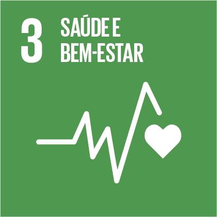
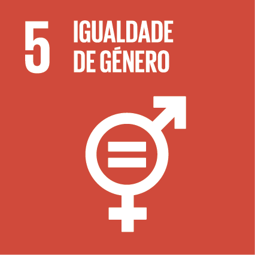
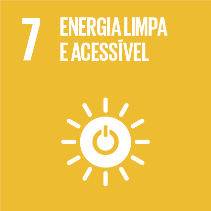
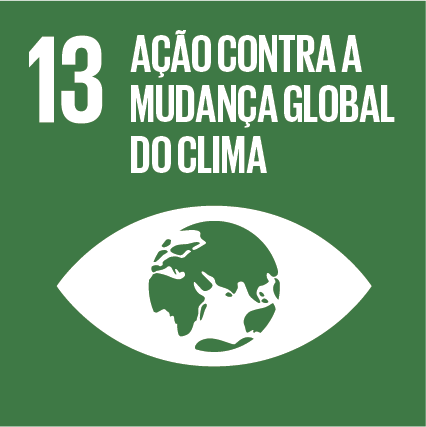
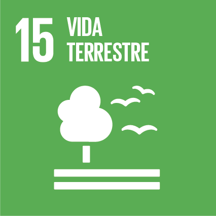
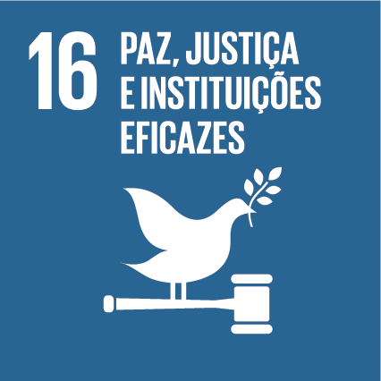
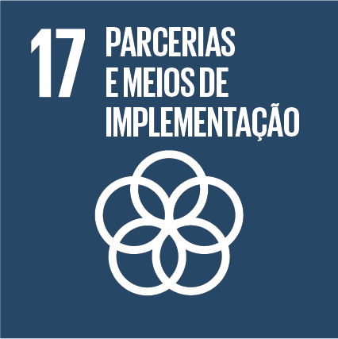

---
params:
  acoes: ""
  bd_pavs: ""
  bd_pavs_agravos: ""
  bd_pavs_acoes: ""
output: 
  pdf_document:
    latex_engine: xelatex
    toc: false
  toc_depth: 3
geometry: left=3cm, top=3cm, right=2cm, bottom=2cm
linestretch: 1.5
fontsize: 12pt
urlcolor: blue
bibliography: bibliografia.bib
csl: vancouver.csl
lang: pt-BR
header-includes:
- \usepackage{lscape}
- \newcommand{\blandscape}{\begin{landscape}}
- \newcommand{\elandscape}{\end{landscape}}
- \usepackage{graphicx}
- \usepackage{fancyhdr}
---

```{r setup, include=FALSE}
library(tidyverse)
library(treemapify)
library(kableExtra)
library(pander)
library(ggalluvial)
library(ggrepel)
library(tufte)
library(splitstackshape)

Sys.setlocale("LC_ALL", "Portuguese_Brazil.utf8") 

#FUNÇÃO PARA FORÇAR ESCALA COM APENAS NÚMEROS INTEIROS NOS GRAFICOS
integer_breaks <- function(n = 5, ...) {
  fxn <- function(x) {
    breaks <- floor(pretty(x, n, ...))
    names(breaks) <- attr(breaks, "labels")
    breaks
  }
  return(fxn)
}

options(ggrepel.max.overlaps = Inf)

knitr::opts_chunk$set(echo = TRUE)
```

```{r data, include = FALSE}
bd_pavs <- params$bd_pavs

bd_agravos <-  params$bd_pavs_agravos 

bd_acoes <-  params$bd_pavs_acoes

soma_acoes <- paste0(nrow(bd_pavs))

lista_ods <- bd_pavs %>% 
  select(`ODS - NOME`) %>% 
  arrange(`ODS - NOME`) 

escreve_lista <- unique(unlist(strsplit(as.character(lista_ods$`ODS - NOME`), ",")))

maior_ods <- bd_pavs %>% 
  group_by(`ODS - NOME`) %>% 
  count() %>% 
  arrange(desc(n)) %>% 
  select(`ODS - NOME`) %>% 
  head(1) %>% 
  paste0()

unlist(as.character(head(lista_ods$`ODS - NOME`),1))

cores_ods <- c("01 ERRADICAÇÃO DA POBREZA" = "#E5243B",
               "02 FOME ZERO E AGRICULTURA SUSTENTÁVEL" = "#DDA63A",
               "03 SAÚDE E BEM ESTAR" = "#4C9F38",
               "04 EDUCAÇÃO DE QUALIDADE" = "#C5192D",
               "05 IGUALDADE DE GÊNERO" = "#FF3A21",
               "06 ÁGUA POTÁVEL E SANEAMENTO" = "#26BDE2",
               "07 ENERGIA LIMPA E ACESSÍVEL" = "#FCC30B",
               "08 TRABALHO DECENTE E CRESCIMENTO ECONÔMICO" = "#A21942",
               "09 INDÚSTRIA, INOVAÇÃO E INFRAESTRUTURA" = "#FD6925",
               "10 REDUÇÃO DAS DESIGUALDADES" = "#DD1367",
               "11 CIDADES E COMUNIDADES SUSTENTÁVEIS" = "#FD9D24",
               "12 CONSUMO E PRODUÇÃO RESPONSÁVEIS" = "#BF8B2E",
               "13 AÇÃO CONTRA A MUDANÇA GLOBAL DO CLIMA" = "#3F7E44",
               "15 VIDA TERRESTRE" = "#56C02B",
               "16 PAZ, JUSTIÇA E INSTITUIÇÕES EFICAZES" = "#00689D",
               "17 PARCERIAS E MEIOS DE IMPLEMENTAÇÃO" = "#19486A")

cores_eixos <- c("A3P (Agenda Ambiental na Administração Pública)" = "#E41A1C", #ODS 09
                 "Água Ar e Solo" = "#377EB8", #ODS 06
                 "Biodiversidade e Arborização" = "#4DAF4A", 
                 "Cultura e Comunicação" = "#984EA3", #ODS 17
                 "Gerenciamento de Resíduos Sólidos" = "#FF7F00", #ODS 03
                 "Horta e Alimentação Saudável" = "#FFFF33", #ODS 02
                 "Revitalização de Espaços Públicos" = "#A65628" #ODS 11
)

hsize = 1.5 #para o gráfico rosca


```
\pagestyle{fancy}
\setlength\headheight{28pt}
\fancyhead[L]{\includegraphics[width=10cm]{cabecalho.png}}

## RELATÓRIO PAVS-ODS: `r params$acoes` (EM CONSTRUÇÃO)  ^[ **ATENÇÃO:** Evite impressões desnecessárias. Se for mesmo preciso imprimir esse documento, prefira a opção em formato livreto, frente e verso ou rascunho. Menos é mais.]
*Jefferson Rodrigues* ^[Assessor técnico I - Meio Ambiente no Santa Marcelina Saúde.]

```{r tabela 00 associacao ods-pavs, fig.width = 7, fig.height = 3, echo=FALSE}
bd_pavs %>% 
  select(`ODS - NOME`) %>% 
  arrange(`ODS - NOME`) %>% 
  distinct() %>% 
  mutate( ODS = case_when(
    `ODS - NOME` == "01 ERRADICAÇÃO DA POBREZA" ~ "{#id .class width=15% height=15%}", 
    `ODS - NOME` == "02 FOME ZERO E AGRICULTURA SUSTENTÁVEL" ~ "{#id .class width=15% height=15%}",
    `ODS - NOME` == "03 SAÚDE E BEM ESTAR" ~ "{#id .class width=15% height=15%}",
    `ODS - NOME` == "04 EDUCAÇÃO DE QUALIDADE" ~ "{#id .class width=15% height=15%}", 
    `ODS - NOME` == "05 IGUALDADE DE GÊNERO" ~ "{#id .class width=15% height=15%}",
    `ODS - NOME` == "06 ÁGUA POTÁVEL E SANEAMENTO" ~ "{#id .class width=15% height=15%}",
    `ODS - NOME` == "07 ENERGIA LIMPA E ACESSÍVEL" ~ "{#id .class width=15% height=15%}",
    `ODS - NOME` == "08 TRABALHO DECENTE E CRESCIMENTO ECONÔMICO" ~ "{#id .class width=15% height=15%}", 
    `ODS - NOME` == "09 INDÚSTRIA, INOVAÇÃO E INFRAESTRUTURA" ~ "{#id .class width=15% height=15%}", 
    `ODS - NOME` == "10 REDUÇÃO DAS DESIGUALDADES" ~ "{#id .class width=15% height=15%}",
    `ODS - NOME` == "11 CIDADES E COMUNIDADES SUSTENTÁVEIS" ~ "{#id .class width=15% height=15%}",
    `ODS - NOME` == "12 CONSUMO E PRODUÇÃO RESPONSÁVEIS" ~ "{#id .class width=15% height=15%}",
    `ODS - NOME` == "13 AÇÃO CONTRA A MUDANÇA GLOBAL DO CLIMA" ~ "{#id .class width=15% height=15%}",
    `ODS - NOME` == "15 VIDA TERRESTRE" ~ "{#id .class width=15% height=15%}",
    `ODS - NOME` == "16 PAZ, JUSTIÇA E INSTITUIÇÕES EFICAZES" ~ "{#id .class width=15% height=15%}", 
    `ODS - NOME` == "17 PARCERIAS E MEIOS DE IMPLEMENTAÇÃO" ~ "{#id .class width=15% height=15%}", 
    TRUE ~ "NA")) %>% 
  mutate(ODS = paste0(ODS, collapse = "")) %>% 
  select(ODS) %>% 
  distinct() %>% 
  pander::pander(split.table = Inf, 
                 style = "rmarkdown", 
                 justify = "left",
                 caption = attr(bd_pavs, "Fonte xxx") )

```
\begingroup
\fontsize{10}{10}\setstretch{1.0}\setlength{\leftskip}{2cm}
**RESUMO:** Relatório técnico automatizado emitido através do *Painel Interativo Saúde Ambiental - ODS Santa Marcelina* ^[O Painel Interativo Saúde Ambiental - ODS Santa Marcelina, https://jrodrigues.shinyapps.io/saudeods/, é um produto técnico apresentado como parte dos requisitos exigidos para a do título de Mestre do Programa de Mestrado Profissional em Saúde Coletiva: Políticas e Gestão em Saúde da Faculdade de Ciências Médicas da Universidade Estadual de Campinas (Unicamp) em 2023. Sob a orientação do professor Dr. Herling Gregorio Aguilar Alonzo, foi elaborado à partir da necessidade apresentada pela equipe técnica do PAVS, através de sua Gestora Regional da Coordenadoria Regional de Saúde Leste, Valéria Y. N., com o apoio da Presidência do Santa Marcelina Saúde e sua Coordenação Administrativa.] ^[Recomendamos a visualização frequente pois ele está em constante atualização, podendo haver melhorias nas próximas versões. Elaborado com a linguagem de programação R[@r2022] utilizando os pacotes tidyverse[@tidyverse], readxl[@readxl], lubridate[@lubridate], DT[@DT],  shiny[@shiny],  plotly[@plotly], shinydashboard[@shinydashboard], shinyalert[@shinyalert], highcharter[@highcharter], treemapify[@treemapify], pander[@pander], ggalluvial[@ggalluvial], ggrepel[@ggrepel], tufte[@tufte] e splitstackshape[@splitstackshape]. Se quiser contribuir com correções, sugestões ou quiser adaptar a ferramenta às necessidades da sua rede de Saúde, por gentileza entre em contato através do e-mail: jeff.sus@hotmail.com ou pelo github: https://github.com/JRodrigues27/2022_ODS_MESTRADO_R. Versão 01/2022, compilado em `r format(Sys.time(), '%d/%m/%y')`. Use Software livre!].Tem a função de apresentar as correlações sugeridas pela equipe do setor Saúde e Meio Ambiente Santa Marcelina entre as ações do PAVS, os ODS, suas metas municipais e seus indicadores. O relatório apresenta ainda correlações entre essas ações, as doencas e agravos associadas aos riscos socioambientais e estratégias de enfrentamentos propostas pela Organização Mundial da Saúde no relatório *"Preventing disease through healthly environments: A global assessment of the burden of disease from environmental risks" @Corvalan2016*.

**Palavras-chave:** SUS, UNICAMP, Santa Marcelina Saúde, Saúde Ambiental, PAVS, Agenda 2030, ODS.

\endgroup

\newpage
## 01. Apresentação

O *Relatório PAVS - ODS* é uma versão imprimível das sugestões de correlações entre **`r params$acoes`** realizados pelas equipes das Unidades Básicas de Saúde (UBS) do Município de São Paulo (MSP) através do Programa Ambientes Verdes e Saudáveis (PAVS) e as metas e indicadores dos Objetivos do Desenvolvimento Sustentável (ODS) expressas na Agenda Municipal 2030. @Andrade2020

Este registro é o excerto de uma matriz mais ampliada que envolve outras ações do PAVS e ainda outras estratégias de intervenções ligadas à saúde ambiental na Atenção Primária do MSP e os ODS. O resultado total e interativo dessa matriz pode ser acessado on-line clicando em https://jrodrigues.shinyapps.io/saudeods/, ou digitando este endereço em seu navegador preferido. 

O link dá acesso ao *Painel Interativo Saúde Ambiental - ODS Santa Marcelina*, onde se buscou relacionar os ODS com as estratégias de atuação de saúde ambiental do MSP no escopo das seguintes diretrizes:

* As ações do Plano Municipal de Saúde (PMS) de São Paulo 2022 - 2025 @Palmierei2022 que envolvem o PAVS. 
* As ações de educação permanente relacionadas à saúde ambiental ou ao  PAVS registras no Plano Municipal de Educação Permanente (PLAMEP) 2022 - 2025 pela Coordenadoria Regional de Saúde (CRS) Leste.
* Programa Ambientes Verdes e Saudáveis (PAVS)^[A SMS de São Paulo disponibiliza muito material sobre o PAVS. Para conhecer mais, acesse: https://www.prefeitura.sp.gov.br/cidade/secretarias/saude/atencao_basica/pavs/index.php?p=215712].

\newpage
O PMS, bem como os Planos de Saúde da Federação, Estados ou Municípios, é  um instrumento de gestão do Sistema Único de Saúde Brasileiro (SUS). Segundo bases epidemiológicas e sociodemográficas, tem a função de direcionar os planejamentos e aportes financeiros para as ações em saúde do município. Para a sua realização conta com participação de usuários, gestores e profissionais de saúde que devem atualizá-lo a cada quatro anos [@instrumentossus2002 p 10]. A versão 2022 - 2025 do PMS sinaliza 30 ações relacionadas à saúde ambiental ou ao PAVS e foi o primeiro instrumento de planejamento setorial do MSP a vincular suas metas aos ODS [@Palmierei2022 p 85].

O PLAMEP é um dos desdobramentos do PMS. No documento norteador para sua elaboração encontramos a definição que o resume como:

\begingroup
\fontsize{10}{10}\setstretch{1.0}\setlength{\leftskip}{4cm}

*"[...] o resultado do planejamento coletivo das ações educativas para a Rede de
Atenção à Saúde (RAS) no âmbito municipal, constituindo-se em um instrumento de gestão
que comporta as prioridades relativas às ações de educação para o trabalho em saúde dos
diferentes territórios e regiões do Município. Deve ser um processo de criação dinâmico e vivo, partindo da identificação de necessidades ou problemas de saúde, no cotidiano do trabalho e fruto de discussão entre os diversos atores (encontro entre trabalhadores, gestores, população, conselheiros e alunos), espaço idealmente potente que deve ser privilegiado." [@Plamep p 10]*

\endgroup

No MSP este planejamento é regionalizado. Na CRS Leste, uma das 06 regiões da SMS, foram realizadas oficinas nas 07 Supervisões Técnicas de Saúde (STS) que a compõe para construí-lo segundo as necessidades locais expressas pelos técnicos das STS e CRS, Unidades de Vigilância em Saúde (UVIS), Conselho Gestores locais e Organizações Sociais de Saúde parceiras (OSS) atuantes nesta CRS. No consolidado das ações de educação permanente para o período de 2022-2025, apresentado no início de 2022, estão previstos 18 temas relacionados à saúde ambiental ou PAVS^[O PLAMEP é monitorado enquanto meta contratual e deve ser revisto anualmente, podendo ser ajustado segundo as necessidades epidemiológicas, sociodemográficas sinalizadas em nível central ou local. @Plamep].

\newpage
Das diretrizes ou programa citados, apenas o PMS já tem estabelecida as relações entre sua metas e os ODS. O objetivo das ferramentas aqui apresentadas, *Relatório PAVS - ODS* e *Painel Interativo Saúde Ambiental - ODS Santa Marcelina*, é auxiliar os Gestores técnicos do PAVS, Agentes de Promoção Ambiental e outros profissionais das UBS que incorporam o PAVS como uma de suas estratégia de prevenção de doenças e promoção da Saúde a visualizarem de maneira mais prática as possíveis associações entre as atividades realizadas no âmbito desse Programa e as metas e indicadores dos ODS da Agenda 2030 municipal @Andrade2020. Com isso torna-se possível incorporar, sempre que a equipe inicie um novo projeto ou ação, atividades que colaborem para o alcance dessas metas, utilizando os indicadores sugeridos como refêrencia, ou ainda adaptando estes segundo a realidade local dos territórios em que atuam e com os usuários com quem interagem.

Como PAVS e os ODS são os termos chave  para o presente relatório, antes de  seguir no esforço de estabelecer relações entre eles, vale antes apresentá-los brevemente. O PAVS é o programa da SMS de São Paulo, sob a Coordenação da Atenção Básica,  que tem por objetivo:

\begingroup
\fontsize{10}{10}\setstretch{1.0}\setlength{\leftskip}{4cm}

*"[...] contribuir na construção das políticas públicas integradas no Município de São Paulo, através de uma agenda de ações integradas com enfoque para o desenvolvimento de políticas de saúde ambiental no âmbito da Estratégia Saúde da Família, visando fomentar o desenvolvimento de uma nova prática de saúde que se traduz em valores de responsabilidade cidadã em torno da defesa da vida e da proteção ambiental, tendo como eixos norteadores o fortalecimento da atuação intersecretarial e intersetorial, a sustentabilidade das intervenções no território e o empoderamento e efetiva participação da comunidade."@portariaPAVS*

\endgroup

OS ODS são a materialização da Agenda 2030. Em 2015 os 193 países membros da Organização das Nações Unidas (ONU), incluindo o Brasil, na Cúpula das Nações Unidadas Sobre o Desenvolvimento Sustentável, elaboraram uma Agenda de compromissos para "acabar com a pobreza, proteger o meio ambiente e o clima e garantir que as pessoas, em todos os lugares, possam desfrutar de paz e de prosperidade"[@agendabr2030; @onu2030]. Conhecida como Agenda 2030, é composta por 17 Objetivos integrados, os ODS, com 169 metas a serem trabalhadas e monitoradas até 2030. No Brasil foi instituída uma comissão Nacional para os ODS em 2016 e em 2018 o Instituto de Pesquisas Avançadas (IPEA) juntamente com o Instituto Brasileiro de Geografia e Estatística (IBGE) foram responsáveis por consolidar a adaptação para o contexto e conjuntura nacional.  

Em 2018 o MSP, voluntariamente, aderiu à Agenda 2030, ratificando o compromisso por meio da lei municipal nº 16.817. Desde então foi iniciado o processo gradual de associação entre as políticas públicas municipais e os ODS [@Andrade2020 p 03]. Associar o PAVS à Agenda 2030 é uma atualização necessária para o cumprimento da sua missão enquanto um Programa da SMS que tem por função incorporar a dimensão da sustentabilidade às ações de saúde na Atenção Básica.

Ainda nesse sentido, este documento pode contribuir como leitura auxiliar ao Relatório Diagnóstico PAVS @DiagnosticoPAVS2020, instrumento de planejamento para intervenções locais do Programa, pois relaciona as doenças e agravos associados à exposições à situações ambientais adversa e sugere linhas de ação, conforme as evidências  científicas compiladas no *Preventing disease through healthy environments : a global assessment of the burden of disease from environmental risks* @Corvalan2016.

Cabe ressaltar que o presente relatório não tem a intenção de ser um manual, mas uma sistematização de indicadores para as metas dos ODS segundo sugeridos pela Agenda 2030 do MSP @Andrade2020, estratégias do PAVS @PAVS2012 e intervenções sugeridas pela OMS @Corvalan2016 que, somados ao olhar critico e perspicaz das equipes das UBS  sobre seus territórios e técnicos de referência para o PAVS, tem o potencial de  engendrar ações efetivas e mensuráveis de saúde coletiva e individuais para colaborar com a melhoria da qualidade de vida da população atendida.

À seguir, na parte 02 deste documento, serão apresentados as correlações entre os ODS, metas e respectivos indicadores da Agenda 2030 municipal e `r params$acoes`. Na terceira parte poderão ser vistas as doenças e agravos e sugestões de enfrentamento relacionadas à essas ações.

Para ver as correlações das outras ações PAVS, acesse o *Painel Interativo Saúde Ambiental - ODS Santa Marcelina* em https://jrodrigues.shinyapps.io/saudeods/ e escolha a ação desejada. Navegue entre as páginas para ver as planilhas e gráficos interativos ou clique no botão "DOWNLOAD" para baixar um outro relatório com as informações personalizadas. 

\newpage
## 02. ODS possivelmente associados com `r params$acoes`

Os ODS estruturados pela ONU foram elaborados para que os esforços dos governos e sociedades fossem mensuráveis e possivel de ser monitorados para avaliar o quanto, enquanto sociedade, estamos progredindo para a redução das iniquidades sociais e dos impactos ambientais negativos. O setor saúde, como uma das atividades humanas, também é passivel de contribuiur neste sentido. A Organização Mundial da Saúde (OMS) avalia que o Objetivo "03 SAÚDE E BEM ESTAR" é o  que está mais diretamente relacionado ao setor, no entanto, não somente. Segundo a organização, dada a sua complexidade, todos os outros ODS têm com o setor alguma relação[@Corvalan2016 p 94-100]. Neste sentido e utilizando a matriz proposta pela OMS, a equipe do setor Saúde e Meio Ambiente do Santa Marcelina Saúde^[A equipe do setor Saúde e Meio Ambiente Santa Marcelina que participou dessa construção é composta por: Almir, dos S. A.; André L. T. U. F.; Carla C. C.; Danilo R. P.; Gabriel R. S. F.; Gisele B. C.; Marlene R. N.; Jefferson dos S. R.; Marcelo C. M.; Paulo R. P. P.; Paulo J. B. V.; Raphael H. M.; Samantha C. H.; Samara S. M.], se reuniu em oficinas para avaliar quais Objetivos, Metas e Indicadores estabelecidos pela Comissão ODS do MSP @Andrade2020 poderiam estar relacionados às ações realizadas pelas equipes das UBS no âmbito do PAVS. 

Observando como intervenção `r params$acoes`, foram relacionados dessa maneira `r soma_acoes` indicadores selecionados, distribuídos entre os ODS: `r knitr::combine_words(escreve_lista, and = " e ", oxford_comma = FALSE)`. Esta distribuição pode ser visualizada no gráfico abaixo, onde se verifica que o ODS `r maior_ods` é o que mais sinaliza indicadores relacionados ao `r params$acoes`:

\newpage
### Gráfico 01: Associações `r params$acoes` e ODS

```{r grafico 01 ods-pavs, fig.width = 8, fig.height = 4, warning=FALSE, echo=FALSE}
bd_pavs %>% 
  group_by(`ACOES PARA CONTRIBUICAO NO ATENDIMENTO DAS METAS`, `ODS - NOME`) %>% 
  count() %>% 
  arrange(desc(n)) %>% 
  mutate(x = hsize) %>% 
  ggplot(aes(x = hsize, y = n, fill = `ODS - NOME`)) +
  geom_col() +
  #geom_text(aes(label = value),
  #         position = position_stack(vjust = 0.5)) +
  coord_polar(theta = "y") +
  scale_fill_manual(values = cores_ods,
                    limits = force) +
  labs(title = stringr::str_wrap(params$acoes, 50),
       subtitle = "ODS relacionados",
       caption = "Fonte: Elaboração própria a partir de Agenda 2030 municipal (2022)") +
  xlim(c(0.2, hsize + 0.5)) +
  theme(panel.background = element_rect(fill = "white"),
        panel.grid = element_blank(),
        axis.title = element_blank(),
        axis.ticks = element_blank(),
        axis.text = element_blank(),
        plot.title = element_text(hjust = 0.5, size = 10),    # Center title position and size
        plot.subtitle = element_text(hjust = 0.5, size = 9),            # Center subtitle
        plot.caption = element_text(hjust = 0, size = 8, face = "italic")# move caption to the left
  )
```

A tabela a seguir apresenta os ODS, suas metas municipais e os respectivos indicadores sugeridos para seu monitoramento cujo os quais a equipe do setor Saúde e Meio Ambiente Santa Marcelina avaliaram guardar relações com `r params$acoes`. 
À partir dela, as equipes das Unidades podem selecionar as metas que contribuirão no direcionamento de seu Projeto/Ação, colaborando para avaliar, através dos indicadores sugeridos, se os objetivos estão sendo alcançados. Como sinalizado anteriormente, é esperado que, em nível local, tanto as metas quanto seus indicadores possam ser adaptados. A equipe de referência PAVS pode ser consultada para esta construção.

\newpage
\blandscape
### Tabela 01: ODS, metas municipais e indicadores potencialmente associadas a `r params$acoes`

```{r tabela 01 indicadores, echo=FALSE, fig.align="center" }
bd_pavs %>% 
  mutate( ODS = case_when(
    `ODS - NOME` == "01 ERRADICAÇÃO DA POBREZA" ~ "{#id .class width=11% height=11%}", 
    `ODS - NOME` == "02 FOME ZERO E AGRICULTURA SUSTENTÁVEL" ~ "{#id .class width=11% height=11%}",
    `ODS - NOME` == "03 SAÚDE E BEM ESTAR" ~ "{#id .class width=11% height=11%}",
    `ODS - NOME` == "04 EDUCAÇÃO DE QUALIDADE" ~ "{#id .class width=11% height=11%}", 
    `ODS - NOME` == "05 IGUALDADE DE GÊNERO" ~ "{#id .class width=11% height=11%}",
    `ODS - NOME` == "06 ÁGUA POTÁVEL E SANEAMENTO" ~ "{#id .class width=11% height=11%}",
    `ODS - NOME` == "07 ENERGIA LIMPA E ACESSÍVEL" ~ "{#id .class width=11% height=11%}",
    `ODS - NOME` == "08 TRABALHO DECENTE E CRESCIMENTO ECONÔMICO" ~ "{#id .class width=11% height=11%}", 
    `ODS - NOME` == "09 INDÚSTRIA, INOVAÇÃO E INFRAESTRUTURA" ~ "{#id .class width=11% height=11%}", 
    `ODS - NOME` == "10 REDUÇÃO DAS DESIGUALDADES" ~ "{#id .class width=11% height=11%}",
    `ODS - NOME` == "11 CIDADES E COMUNIDADES SUSTENTÁVEIS" ~ "{#id .class width=11% height=11%}",
    `ODS - NOME` == "12 CONSUMO E PRODUÇÃO RESPONSÁVEIS" ~ "{#id .class width=11% height=11%}",
    `ODS - NOME` == "13 AÇÃO CONTRA A MUDANÇA GLOBAL DO CLIMA" ~ "{#id .class width=11% height=11%}",
    `ODS - NOME` == "15 VIDA TERRESTRE" ~ "{#id .class width=11% height=11%}",
    `ODS - NOME` == "16 PAZ, JUSTIÇA E INSTITUIÇÕES EFICAZES" ~ "{#id .class width=11% height=11%}", 
    `ODS - NOME` == "17 PARCERIAS E MEIOS DE IMPLEMENTAÇÃO" ~ "{#id .class width=11% height=11%}",
    TRUE ~ "NA")) %>% 
  transmute(
    ODS = ODS,
    `Meta ODS Municipal - DESCRICAO` = `Meta ODS Municipal - DESCRICAO`,
    INDICADOR = INDICADOR, 
    REFERENCIA = REFERENCIA.y) %>% 
  arrange(ODS) %>% 
  pander::pander(split.cells = c(02, 42, 23, 13),
                 split.table = Inf, 
                 justify = c("center","left","left","left"))
```

\elandscape
\newpage
## 03. Riscos ambientais e ações do PAVS para seu enfrentamento 
A OMS estima que cerca de 1/4 de todas as mortes ocorridas anualmente no mundo estão relacionadas aos riscos ambientais. Para auxiliar os profissionais da área a identificar e planejar ações para a redução dessas mortes, bem como a redução de anos de vida perdidos por incapacidade em decorrência das doenças e agravos causadas por estes riscos (DALY), publicou em 2016 a revisão atualizada do Relatório *"Preventing Disease through healthly environments"*. Nele foram listadas 133 doenças ou agravos que, segundo evidências, tem relação direta com riscos ambientais, variando percentualmente segundo sua fração atribuível^[A Fração Atribuível Populacional é a redução proporcional de mortes ou doenças que ocorreria se a exposição ao risco fosse removida ou reduzida[@Corvalan2016 p 06]]. Essas doenças ou agravos estão categorizadas em 4 grupos: "Agravos", "Condições neonatais e nutricionais", "Doenças ou Agravos não transmissíveis (DANT)" e "Doenças infecciosas e parasitárias".[@Corvalan2016 p 14-84]

O PAVS pressupõe a realização de ações de promoção de saúde e/ou prevenção de agravos e doenças conduzidas pelas equipes das UBS com usuários e parceiros nos territórios, sob a perspectiva da redução da exposição humana aos riscos ambientais e/ou a promoção de ambientes saudáveis. Para organizar de maneira didática as possíveis linhas de intervenção, os formuladores do programa instituiram eixos temáticos que as agrupassem. São 07 os eixos temáticos PAVS: "Agenda Ambiental na Administração Pública (A3P)", "Água, Ar e Solo", "Biodiversidade e Arborização", "Cultura e Comunicação", "Gerenciamento de Resíduos Sólidos", "Horta e Alimentação Saudável" e "Revitalização de Espaços Públicos".

Os eixos PAVS são bem abrangentes e, para os profissionais que não tiveram em suas formações a oportunidade de discutir e aprofundar sobre a relação saúde e ambiente, podem parecer difusos. O próprio conceito de saúde ambiental é um terreno em disputa[@Ribeiro2004], mas como não é a intenção deste documento se debruçar em uma discussão epistemológica, mas avaliando a necessidade de trabalhar com um alinhamento mínimo sobre o tema,  a introdução do termo disponível no site da Fundação Nacional de Saúde nos parece bem objetivo e de fácil compreensão: 

\newpage
\begingroup
\fontsize{10}{10}\setstretch{1.0}\setlength{\leftskip}{4cm}
*"...  Saúde Ambiental são todos aqueles aspectos da saúde humana, incluindo a qualidade de vida, que estão determinados por fatores físicos, químicos, biológicos, sociais e psicológicos no meio ambiente. Também se refere à teoria e prática de prevenir ou controlar tais fatores de risco que, potencialmente, possam prejudicar a saúde de gerações atuais e futuras (OMS, 1993)." @funasa *

\endgroup

Avaliando os eixos PAVS, as intervenção das equipes das UBS para o PAVS nos últimos 10 anos e a luz deste conceito de saúde ambiental, os Assessores Técnicos de Meio Ambiente do Santa Marcelina Saúde^[Assessores Técnicos: Jefferson S. R, Paulo José B. V., Paulo Roberto P. P.] relacionaram as seguintes possibilidades de intervenções práticas sob o âmbito do Programa^[Com excessão dos Projetos e ações visando atender aos objetivos da "Agenda Ambiental na Administração Pública (A3P)" e  o "Mais saúde, menos plástico", que têm a intenção de reduzir o impacto ambiental decorrente das atividades da unidade de saúde, todos os outros podem estar relacionados à saúde ambiental.]. As intervenções foram agrupadas segundo faixas etárias, linhas de cuidado direcionadas às populações mais vulneráveis ou os riscos sinalizados no conceito de saúde ambiental:

* Grupo de crianças e adolescentes com temas relacionados à saúde ambiental (Crianças e adolesc)
* Projetos e ações socioambientais direcionados a linha de cuidado:
   * materno infantil (Materno inf)
   * Saúde da mulher (Mulher)
   * Saúde do idoso (Idoso)
   * das pessoas com deficiência (PCD)
* Projetos e ações socioambientais de enfrentamento a doenças e agravos relacionados a:
   * resíduos e animais sinantrópicos (Resíduo/Sinantrópico)
   * transtorno de acumulação (Acumulação)
   * poluição do ar (Ar)
   * poluição solo (Solo)
   * desastres socioambientais (Desastres)

\newpage   
* Projetos e ações socioambientais de enfrentamento à: 
   * doenças e agravos de veiculação hídrica (Veiculação hidr)
   * insegurança alimentar (Insegurança alim)
* Projetos e ações socioambientais de promoção a:
   * alimentação saudável (Alimentação)
   * ambientes verdes e saudáveis (Ambientes)
* Projetos e ações socioambientais de compostagem de sobra de alimentos in natura (Compostagem)
* Projetos de promoção de saúde coletiva em espaços públicos (Espaços públicos)
* Projetos e ações visando atender aos objetivos da Agenda Ambiental na Administração Pública (A3P)
* Projetos e ações que reduzam os riscos dos resíduos de serviço de saúde (RSS)
* Mais saúde, menos plástico (Menos plásticos)

Cada tipo de intervenção está geralmente mais associada a um eixo PAVS, mas a depender da situação local, em especial se o projeto/ação for direcionado a determinada faixa etária/linha de cuidado, pode-se, em um segundo momento, definir melhor qual o eixo específico está sendo trabalhado de acordo com os riscos e potencialidades identificados no território. À seguir a representação total das correlações entre as ações de saúde ambiental ou gestão ambiental realizáveis pelas equipes das UBS com os Eixos PAVS:

\newpage
\blandscape
### Gráfico 02: Associação entre intervenções de saúde ou gestão ambiental e Eixos PAVS^[O eixo PAVS "Cultura e Comunicação" englobaria todas as ações que tem como estratégia utilizar a Cultura de Paz e não violência e a Educomunicação [ @PAVS2012 p 99-107]. Como essas são formas de abordagem, não aspectos ambientais que podem oferecer risco à saúde ou potencialidade para a melhoria dos aspectos que promovem saúde, não conseguimos identificar ações diretamente relacionadas que já não estivesse comtemplada em um dos outros eixos. Entendemos que a Cultura de paz e não violência e/ou a Educomunicação são ferramentas que devem ser utilizadas pelas equipes de Saúde de maneira transversal, independente da temática ou linha de cuidado.]

```{r grafico 02 pavs-acoes_geral, fig.align = "center", fig.height = 5, fig.width = 8, warning=FALSE, echo=FALSE}
bd_acoes %>%
  mutate(projetos = case_when(
    `Projetos/Ações` == "Grupo de crianças e adolescentes com temas relacionados à saúde ambiental" ~ "Crianças e adolesc",
`Projetos/Ações` == "Mais saúde, menos plástico" ~ "Menos plásticos",
`Projetos/Ações` == "Projetos de promoção de saúde coletiva em espaços públicos" ~ "Espaços públicos",
`Projetos/Ações` == "Projetos e ações que reduzam os riscos dos resíduos de serviço de saúde" ~ "RSS",
`Projetos/Ações` == "Projetos e ações socioambientais de compostagem de sobra de alimentos in natura" ~ "Compostagem", 
`Projetos/Ações` == "Projetos e ações socioambientais de enfrentamento a doenças e agravos de veiculação hídrica" ~ "Veiculação hidr",
`Projetos/Ações` == "Projetos e ações socioambientais de enfrentamento a doenças e agravos relacionados a desastres socioambientais" ~ "Desastres",
`Projetos/Ações` == "Projetos e ações socioambientais de enfrentamento a doenças e agravos relacionados a poluição do ar" ~ "Ar",
`Projetos/Ações` == "Projetos e ações socioambientais de enfrentamento a doenças e agravos relacionados a poluição solo" ~ "Solo",
`Projetos/Ações` == "Projetos e ações socioambientais de enfrentamento a doenças e agravos relacionados a resíduos e animais sinantrópicos" ~ "Resíduo/Sinantrópico",
`Projetos/Ações` == "Projetos e ações socioambientais de enfrentamento a doenças e agravos relacionados à transtorno de acumulação" ~ "Acumulação",
`Projetos/Ações` == "Projetos e ações socioambientais de enfrentamento à insegurança alimentar" ~ "Insegurança alim",
`Projetos/Ações` == "Projetos e ações socioambientais de enfrentamento de doenças e agravos relacionados a linha de cuidado materno infantil" ~ "Materno inf",
`Projetos/Ações` == "Projetos e ações socioambientais de promoção a alimentação saudável" ~ "Alimentação",
`Projetos/Ações` == "Projetos e ações socioambientais de promoção de ambientes verdes e saudáveis" ~ "Ambientes",
`Projetos/Ações` == "Projetos e ações socioambientais direcionados a linha de cuidado das PCD" ~ "PCD",
`Projetos/Ações` == "Projetos e ações socioambientais direcionados a linha de cuidado Saúde da mulher" ~ "Mulher",
`Projetos/Ações` == "Projetos e ações socioambientais direcionados a linha de cuidado Saúde do idoso" ~ "Idoso",
`Projetos/Ações` == "Projetos e ações visando atender aos objetivos da Agenda Ambiental na Administração Pública (A3P)" ~ "A3P", 
    TRUE ~ "NA")
  ) %>% 
  ggplot(aes(axis1 = projetos, 
             axis2 = `Eixos PAVS`, y = n)) +
  geom_alluvium(aes(fill = `Eixos PAVS`),
                width = 1/6) +
  geom_stratum(width = 1/6) +
  ggrepel::geom_label_repel(
  aes(label = ifelse(after_stat(x) == 1, stringr::str_wrap(as.character(after_stat(stratum)), 30), ""),
      segment.size = 0.1),
  stat = "stratum", size = 4, direction = "y", nudge_x = -.4) +
  ggrepel::geom_label_repel(
    aes(label = ifelse(after_stat(x)  == 2, stringr::str_wrap(as.character(after_stat(stratum)), 30), ""),
      segment.size = 0.1),
    stat = "stratum", size = 4, direction = "y", nudge_x = .4
  )+
  scale_x_discrete(limits = c("Eixos PAVS", "projetos"),
                   expand = c(0.20, 0.10)) +
  scale_fill_manual(values = cores_eixos,
                    limits = force) +
  labs(title = "Correlações entre intervenções de saúde ou gestão ambiental e Eixos PAVS",
       caption = "Fonte: Elaboração própria a partir de Guia PAVS (2022)") +
  theme_void() +
  theme(
    legend.position = "none",
    plot.title = element_text(hjust = 0.5, size = 10),    # Center title position and size
    plot.subtitle = element_text(hjust = 0.5, size = 9),            # Center subtitle
    plot.caption = element_text(hjust = 0, size = 8, face = "italic"),# move caption to the left
  )

```

\elandscape
\newpage
No caso específico de `r params$acoes`, a/as relações estabelecidas com os Eixos temáticos PAVS são como abaixo ^[Nos casos de intervenções relacionadas a mais de dois eixos PAVS, o gráfico apresentará as proporções relativas.]:  

### Gráfico 03: Associação entre `r params$acoes` e Eixos PAVS

```{r grafico 03 pavs-acoes, fig.width = 7, fig.height = 3, warning=FALSE, echo=FALSE}
bd_acoes %>% 
  filter(`Projetos/Ações` == params$acoes) %>% 
  group_by(`Eixos PAVS`) %>% 
  count() %>% 
  arrange(desc(n)) %>% 
  ggplot(aes(area = n, fill = `Eixos PAVS`, label = `Eixos PAVS`)) +
  geom_treemap(alpha = 0.6) +
  labs(title = stringr::str_wrap(params$acoes, 50),
       subtitle = "Eixos PAVS relacionados",
       caption = "Fonte: Elaboração própria a partir de Guia PAVS (2022)") +
  scale_fill_manual(values = cores_eixos,
                    limits = force) +
  theme_void() +
  theme(
    plot.title = element_text(hjust = 0.5, size = 10),    # Center title position and size
    plot.subtitle = element_text(hjust = 0.5, size = 9),            # Center subtitle
    plot.caption = element_text(hjust = 0, size = 8, face = "italic"),# move caption to the left
  )

```

É claro que sempre se deve considerar as complexidades do processo saúde-doença, seus determinantes e condicionantes, as dimensões individuais, subindividuais ou coletivas ou sobre a condição, intencional ou não, do indivíduo estar aberto aos riscos, para planejar as ações de saúde [ @Buss2007; @Narvai2008; @Caponi2009 ]. No entanto,  reconhecendo os riscos socioambientais, suas  frações atríbuíveis associadas e utilizando a experiência registrada em fontes verificáveis, pode-se planejar as ações, no caso as intervenções do PAVS, utilizando indicadores para avaliar os seus impactos tanto na promoção de saúde quanto na prevenção de agravos e doenças.
No gráfico abaixo estão as doenças e agravos listadas no Relatório da OMS *"Preventing Disease through healthly environments"* @Corvalan2016, dispostas segundo sua fração atribuível, que a implementação de `r params$acoes` podem colaborar na obtenção de resultados positivos:

\newpage
### Gráfico 04: Doenças e agravos,  riscos ambientais associados e frações atribuíveis

```{r grafico 04 pavs-agravos,fig.width = 10, fig.height = 5, echo=FALSE, error=TRUE, warning=FALSE, message=FALSE }
bd_agravos %>% 
  arrange(desc(`Risco ambiental`)) %>% 
  ggplot(aes(x=`Doencas/ Agravos`, 
             y=`Risco ambiental`*100, 
             color= CATEGORIAS,
             size=`Risco ambiental`*100)) +
  geom_point(data = bd_agravos,
             alpha=0.5) +
  scale_size(range = c(.1, 24), 
             name="Fração atribuível aos riscos ambientais - FAA", 
             guide = "none") + # esconde a legenda de tamanhos
  scale_color_brewer(palette = "Set1",
                     type = "qual",
                     labels = ~ stringr::str_wrap(.x, width = 20),
                     guide = guide_legend(override.aes = list(size = 8))
  ) +
  scale_x_discrete(labels = function(`Doencas/ Agravos`) str_wrap(`Doencas/ Agravos`, 20)) + 
  ylim(0,120) +
  ylab("Fração atribuível aos riscos ambientais - FAA (%)") +
  xlab("Agravos/Doenças") +
  labs(title = stringr::str_wrap(params$acoes, 50),
       subtitle = "doenças ou agravos relacionados e fração atribuível aos riscos ambientais",
       caption = "Fonte: WHO, 2016") +
  theme_classic()+
  geom_segment( aes(x =`Doencas/ Agravos`, 
                    xend =`Doencas/ Agravos`, 
                    y = 0, 
                    yend = `Risco ambiental`*100), size = 0.5) +
  theme(
    legend.text=element_text(size=10),
    plot.title = element_text(hjust = 0.5, size = 14),    # Center title position and size
    plot.subtitle = element_text(hjust = 0.5),            # Center subtitle
    plot.caption = element_text(hjust = 0, face = "italic"),# move caption to the left
    axis.text.x = element_text(angle = 45, 
                               vjust = 1, 
                               hjust= 1)
  )
```

Abaixo pode ser visualizada as informações plotadas no gráfico anterior, com a sinalização de que método a OMS utilizou para sistematizar a fração atribuível às doencas e agravos^[ Avaliação comparativa de fatores de risco (CRA), História natural da doença, Cálculo baseado em dados epidemiológicos específicos, Entrevista com especialistas e Dados coletados em países em desenvolvimento - LMIC.], organizada segundo esta variável:

### Tabela 02: Doencas e agravos organizadas segundo as frações atribuíveis relacionadas aos riscos ambientais

```{r tabela 02 agravos, echo=FALSE, error=TRUE }
bd_agravos %>%
  arrange(desc(`Risco ambiental`)) %>% 
  transmute(
    `Agravos/Doenças` = `Doencas/ Agravos`,
    Categorias = CATEGORIAS,
    `Fração atribuível aos riscos ambientais - FAA` = paste0(`Risco ambiental` * 100, "%"),
    `Método para estabelecimento da FAA` = Metodo
  ) %>% 
  pander::pander(split.cells = c(15, 25, 20, 20),
                 split.table = Inf, 
                 justify = c("left","left","center","left")
  )
```

Além de apresentar as doenças e agravos relacionados aos aspectos ambientais, conforme demonstrado anteriormente, a OMS compilou também em seu relatório estratégias de intervenção exitosas. São experiências realizadas em diferentes países e captadas em fontes verificáveis. A tabela à seguir sinaliza de maneira resumida essas ações fazendo sugestão de associação com o/os eixos PAVS relacionado à `r params$acoes`.

\newpage
\blandscape

### Tabela 03: Ações PAVS e/ou sugeridas pela OMS para o enfrentamento das doenças e agravos sensíveis aos riscos ambientais selecionados

```{r tabela 03 acoes, echo=FALSE }
bd_agravos %>% 
  transmute(
    `Agravos/Doenças` = `Doencas/ Agravos`,
    `Eixos PAVS` = `EIXO PAVS`,
    `Ações para enfrentamento sugeridas` = `Ações para enfrentamento sugeridas`) %>% 
  pander::pander(split.cells = c(15, 20, 45),
                 split.table = Inf,
                 justify = c("left","left","left")
  )

```

\elandscape
\newpage
## 04. Considerações Finais
Contribuir com a Agenda Global 2030 não significa apenas colar os adesivos dos ODS nas comunicações institucionais ou relatórios, a proposta da OMS é muito mais ambiciosa. Para que os governos, insituições, iniciativas coletivas ou individuais contribuam de fato com o esforço de atingir os objetivos da agenda 2030, é necessário que se busque realmente atender às metas de cada ODS.

Fornecer subsídios para que os profissionais das frentes de trabalho conheçam a agenda 2030,  quais são seus objetivos, que compreendam seus papéis enquanto cidadãos e profissionais neste contexto e avaliem quais ações desenvolvidas por eles já contribuem no sentido de atendê-la, é o primeiro passo. Junto a este esforço, vale buscar quais são as metas municipais exequíveis e aplicaveis à realidade local que ainda não estão sendo monitoradas. 

Com isto as equipes podem selecionar os indicadores que pretendem monitorar e estabelecer períodos para sua avaliação. Importante ressaltar que este processo só acontece após uma decisão de alto nível, que pressupõe, mesmo após a assinatura e promulgação de lei específica, o compromisso e pactuação entre gestores. Sem ela a implantação da Agenda se torna inviável. Um plano deve ser montado para que a realização de estratégias de educação permanente, monitoramento de implementação da proposta, ferramentas para sua manutenção e prestação de contas para a sociedade sejam desenvolvidas e conhecida por todos os envolvidos.

Após esta pactuação de alto nível, as ferramentas aqui apresentadas pretendem contribuir com a primeira etapa da implementação local, levando os Objetivos, metas e indicadores municipais dos ODS ao conhecimento dos gestores e equipes. O *Painel Interativo Saúde Ambiental - ODS Santa Marcelina* oferece uma visão panorâmica das possíveis associações entre as estratégias já instituídas e os ODS, e os *Relatório PAVS - ODS* gerados por ela podem servir para Gestores e equipes locais  ajustarem de maneira prática as associações entre Objetivos, metas e indicadores. 

\newpage
As duas ferramentas têm a vantagem de serem rapidamenta corrigidas, bastando apenas editar as planilhas que servem como banco de dados ou o script gerado na linguagem R, disponibilizando on-line imediatamente as informações atualizadas e sem grandes custos, haja vista que tratam-se de ferramentas construídas sobre plataformas livres. No entanto tem também seus limites. Até aqui a proposta foi relacionar as ações da Atenção Primária apenas com um dos seus Programas, o PAVS, mas é sabido que outros têm intima relação com o atendimento das Metas da Agenda 2030. Para incluir as outras ações seria necessária a realização de novos estudos, pactuações, aprovações e alinhamentos.

Sobre os *Relatórios PAVS - ODS*, a seção que apresenta as sugestões de enfrentamento às doenças e agravos relacionados aos aspectos socioambientais, trata-se apenas de mais uma contribuição, coletada de uma publicação específica. Embora relevante, deve ser somada, adaptada e constantemente atualizadas segundo a produção que temos publicadas no Brasil. As Universidades brasileiras, instâncias do SUS, produzem vasto material sobre saúde ambiental que precisa ser conhecido pelos profissionais que atuam ou pesquisam a área. Sistematizá-las em um banco único poderia ser um desdobramento futuro à ser diponibilizado aos interessados.

Por estes motivos, avaliamos ser de suma importância essa parceria entre a Academia, aqui representada pela Universidade Estadual de Campinas, a gestão das políticas Públicas, representada pela Secretaria Municipal de Saúde de São Paulo e sua Coordenação de Atenção Básica, e a sociedade civil, representada pelo Santa Marcelina Saúde e os profissionais de suas equipes. Apenas através deste engajamento e articulação será possível avançarmos enquanto sociedade, buscando oferecer serviços públicos com mais qualidade, maior transparência e potentes em reduzir as inequidades socioambientais.

## 05. Referências