---
params:
  acoes: ""
  bd_pavs: ""
  bd_pavs_agravos: ""
output: 
  pdf_document:
    latex_engine: xelatex
    toc: false
  toc_depth: 2
mainfont: "Times New Roman"
linestretch: 1.5
fontsize: 12pt
urlcolor: blue
bibliography: bibliografia.bib
csl: vancouver.csl
header-includes:
- \usepackage{lscape}
- \newcommand{\blandscape}{\begin{landscape}}
- \newcommand{\elandscape}{\end{landscape}}

---


```{r setup, include=FALSE}
library(tidyverse)
library(kableExtra)
library(pander)
library(ggalluvial)


#FUNÇÃO PARA FORÇAR ESCALA COM APENAS NÚMEROS INTEIROS NOS GRAFICOS
integer_breaks <- function(n = 5, ...) {
  fxn <- function(x) {
    breaks <- floor(pretty(x, n, ...))
    names(breaks) <- attr(breaks, "labels")
    breaks
  }
  return(fxn)
}

knitr::opts_chunk$set(echo = TRUE)
```


---
## RELATÓRIO PAVS-ODS: `r params$acoes`
*Jefferson dos Santos Rodrigues* ^[ Produto técnico elaborado no Programa de Saúde Coletiva da UNICAMP, em parceria com o Santa Marcelina Saúde para contribuir com o aprimoramento das estratégias de saúde ambiental da Secretaria Municipal de Saúde de São Paulo]

---

```{r data, include = FALSE}
bd_pavs <- params$bd_pavs

bd_agravos <-  params$bd_pavs_agravos

cores_ods <- c("01 ERRADICAÇÃO DA POBREZA" = "#E5243B",
               "02 FOME ZERO E AGRICULTURA SUSTENTÁVEL" = "#DDA63A",
               "03 SAÚDE E BEM ESTAR" = "#4C9F38",
               "04 EDUCAÇÃO DE QUALIDADE" = "#C5192D",
               "05 IGUALDADE DE GÊNERO" = "#FF3A21",
               "06 ÁGUA POTÁVEL E SANEAMENTO" = "#26BDE2",
               "07 ENERGIA LIMPA E ACESSÍVEL" = "#FCC30B",
               "08 TRABALHO DECENTE E CRESCIMENTO ECONÔMICO" = "#A21942",
               "09 INDÚSTRIA, INOVAÇÃO E INFRAESTRUTURA" = "#FD6925",
               "10 REDUÇÃO DAS DESIGUALDADES" = "#DD1367",
               "11 CIDADES E COMUNIDADES SUSTENTÁVEIS" = "#FD9D24",
               "12 CONSUMO E PRODUÇÃO RESPONSÁVEIS" = "#BF8B2E",
               "13 AÇÃO CONTRA A MUDANÇA GLOBAL DO CLIMA" = "#3F7E44",
               "15 VIDA TERRESTRE" = "#56C02B",
               "16 PAZ, JUSTIÇA E INSTITUIÇÕES EFICAZES" = "#00689D",
               "17 PARCERIAS E MEIOS DE IMPLEMENTAÇÃO" = "#19486A")
```

O *Relatório PAVS - ODS* ^[ **ATENÇÃO:** Evite impressões desnecessárias. Se for mesmo preciso imprimir esse documento, prefira a opção em formato livreto, frente e verso ou rascunho. Menos é mais.] ^[ Este relatório foi compilado em `r format(Sys.time(), '%d/%m/%y')`. Versão 01/2022. Recomendamos a visualização constante pois ele está em melhoria contínua, podendo haver correções e melhorias nas próximas versões. Se ao avaliar as ferramentas apresentadas surgirem possibilidade de melhoria, por gentileza entre em contato através do e-mail: jrodrigues.sus@hotmail.com] é uma versão imprimível das sugestões de correlações entre **`r params$acoes`** realizados através do Programa Ambientes Verdes e Saudáveis (PAVS) e as metas e indicadores dos Objetivos do Desenvolvimento Sustentável (ODS).  Este trabalho compõe uma matriz mais ampliada que envolve outras estratégias de intervenções ligadas à saúde ambiental na Atenção Primária do Município de São Paulo e os ODS. 
O resultado total e interativo dessa matriz pode ser acessado on-line clicando em https://jrodrigues.shinyapps.io/saudeods/, ou digitando este endereço em seu navegador preferido. 
O link dá acesso ao *Painel Interativo Saúde Ambiental - ODS Santa Marcelina*, onde foram compiladas as estratégias de atuação de saúde ambiental do Município de São Paulo no escopo das seguintes diretrizes:

* Programa Ambientes Verdes e Saudáveis (PAVS) @PAVS2012
* As ações do Plano Municipal de Saúde 2022 - 2025 que envolvem o PAVS @Palmierei2022
* As ações de educação permanente planejadas pela Coordenadoria Regional de Saúde Leste (CRS Leste), Supervisões Técnicas de Saúde (STS), Unidades de Vigilância em Saúde (UVIS), Organizações Sociais de Saúde parceiras  (OSS) atuantes nesta CRS e registras no Plano Municipal de Educação Permanente para 2022 - 2025

O objetivo dessas ferramentas é auxiliar os Gestores técnicos do PAVS, Agentes de Promoção Ambiental e outros profissionais das Unidades Básicas de Saúde que incorporam o PAVS como uma de suas estratégia de prevenção de doenças e promoção da Saúde a visualizarem de maneira mais prática as possíveis associações entre as atividades realizadas no âmbito desse Programa e as metas e indicadores dos ODS nos âmbitos da Agenda 2030 municipal e global @Andrade2020. O relatório colabora ainda como leitura auxiliar ao Relatório Diagnóstico PAVS @DiagnosticoPAVS2020. A equipe com seu Relatório diagnóstico PAVS estabelecendo associações entre os possíveis Projetos e ações PAVS, à luz dos eixos estruturantes do Programa, com potencial de enfrentamento às doenças ou agravos relacionados aos riscos ambientais apresentados no Relatório *Preventing disease through healthy environments : a global assessment of the burden of disease from environmental risks* @Corvalan2016, sistematizado pela Organização Mundial da Saúde. 

O presente relatório não tem a intenção de ser um manual e sim um roteiro para avaliar criticamente as associações sugeridas e avançar em ações efetivas para colaborar com a melhoria da qualidade de vida da população atendida pelas equipes de saúde.
Ao final do relatório, além das referências utilizadas para a sua elaboração, conta com um um anexo com sugestões de leituras que podem colaborar com a ampliação do conhecimento sobre o tema saúde ambiental.


## ODS possivelmente associadas em `r params$acoes`:

```{r associacao ods-pavs, fig.width = 7, fig.height = 3, echo=FALSE}
bd_pavs %>% 
  select(`ODS - NOME`) %>% 
  arrange(`ODS - NOME`) %>% 
  distinct() %>% 
  mutate( ODS = case_when(
    `ODS - NOME` == "01 ERRADICAÇÃO DA POBREZA" ~ "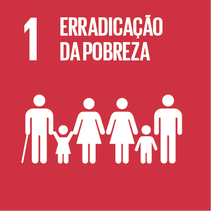{#id .class width=15% height=15%}", 
    `ODS - NOME` == "02 FOME ZERO E AGRICULTURA SUSTENTÁVEL" ~ "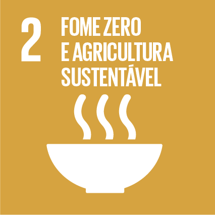{#id .class width=15% height=15%}",
    `ODS - NOME` == "03 SAÚDE E BEM ESTAR" ~ "{#id .class width=15% height=15%}",
    `ODS - NOME` == "04 EDUCAÇÃO DE QUALIDADE" ~ "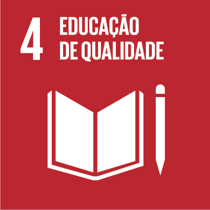{#id .class width=15% height=15%}", 
    `ODS - NOME` == "05 IGUALDADE DE GÊNERO" ~ "{#id .class width=15% height=15%}",
    `ODS - NOME` == "06 ÁGUA POTÁVEL E SANEAMENTO" ~ "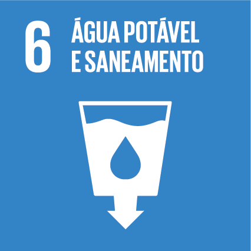{#id .class width=15% height=15%}",
    `ODS - NOME` == "07 ENERGIA LIMPA E ACESSÍVEL" ~ "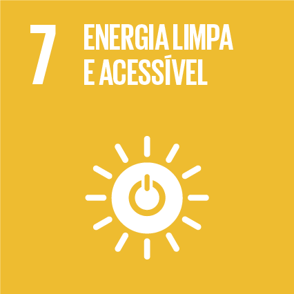{#id .class width=15% height=15%}",
    `ODS - NOME` == "08 TRABALHO DECENTE E CRESCIMENTO ECONÔMICO" ~ "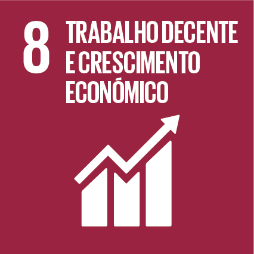{#id .class width=15% height=15%}", 
    `ODS - NOME` == "09 INDÚSTRIA, INOVAÇÃO E INFRAESTRUTURA" ~ "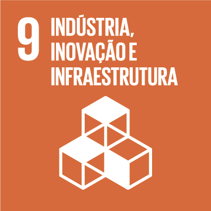{#id .class width=15% height=15%}", 
    `ODS - NOME` == "10 REDUÇÃO DAS DESIGUALDADES" ~ "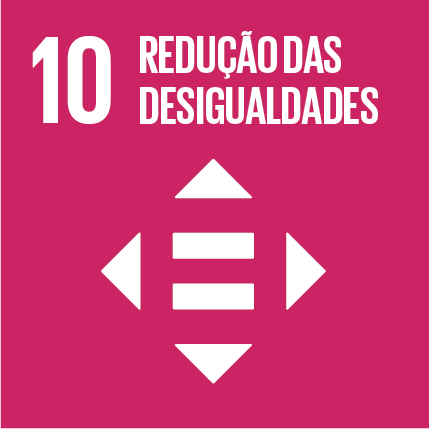{#id .class width=15% height=15%}",
    `ODS - NOME` == "11 CIDADES E COMUNIDADES SUSTENTÁVEIS" ~ "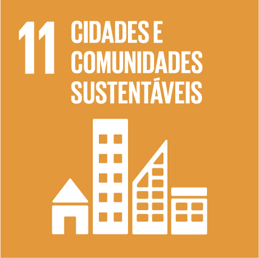{#id .class width=15% height=15%}",
    `ODS - NOME` == "12 CONSUMO E PRODUÇÃO RESPONSÁVEIS" ~ "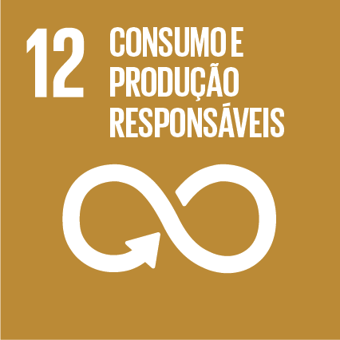{#id .class width=15% height=15%}",
    `ODS - NOME` == "13 AÇÃO CONTRA A MUDANÇA GLOBAL DO CLIMA" ~ "{#id .class width=15% height=15%}",
    `ODS - NOME` == "15 VIDA TERRESTRE" ~ "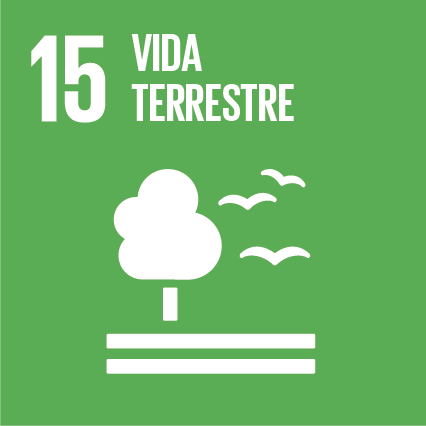{#id .class width=15% height=15%}",
    `ODS - NOME` == "16 PAZ, JUSTIÇA E INSTITUIÇÕES EFICAZES" ~ "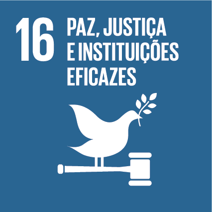{#id .class width=15% height=15%}", 
    `ODS - NOME` == "17 PARCERIAS E MEIOS DE IMPLEMENTAÇÃO" ~ "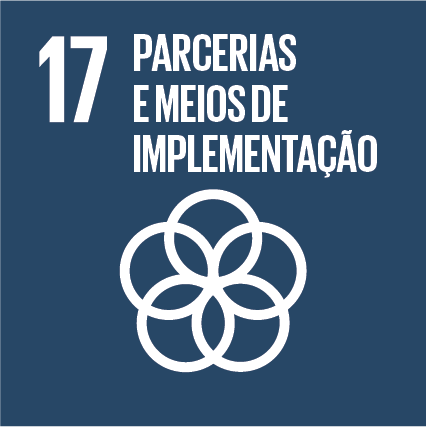{#id .class width=15% height=15%}", 
    TRUE ~ "NA")) %>% 
  mutate(ODS = paste0(ODS, collapse = "")) %>% 
  select(ODS) %>% 
  distinct() %>% 
  pander::pander(split.table = Inf, 
                 style = "rmarkdown", 
                 justify = "left",
                 caption = attr(bd_pavs, "Fonte xxx") )

```

OS diagramas aluviais são soluções gráficas que nos possibilita verificar as  No gráfico aluvial  partir do gráfico aluvial com quais ODS `r params$acoes` estabelecem mais relações. Essas relações poderão ser visualizadas através das metas e indicadores expressos na tabela que segue logo abaixo ao gráfico. 

Ourtra,,,,,

```{r ods-pavs, fig.width = 7, fig.height = 3, echo=FALSE}
bd_pavs %>% 
  group_by(`ODS - NOME`, `ACOES PARA CONTRIBUICAO NO ATENDIMENTO DAS METAS`) %>% 
  count() %>% 
  arrange(desc(n)) %>% 
  ggplot(aes(axis1 = `ACOES PARA CONTRIBUICAO NO ATENDIMENTO DAS METAS`, 
             axis2 = `ODS - NOME`, y = n, fill = `ODS - NOME`)) +
  scale_fill_manual(values = cores_ods,
                    limits = force) +
  geom_alluvium(aes(fill = `ODS - NOME`)) +
  geom_stratum(color = 'white', size = 1) +
  labs(title = stringr::str_wrap(params$acoes, 50),
       subtitle = "ODS relacionadas",
       caption = "Fonte: Agenda 2030 municipal") +
  scale_size(guide = 'none') +
  annotate("text", 
           x = 1, 
           y = 8,
           size = 2.5,
           label = stringr::str_wrap(params$acoes, 40),
           color = "white",
           fontface = "bold",
           angle = 90) +
  scale_x_discrete(limits = c("ODS - NOME", "SITUAÇÕES"),
                   expand = c(0.15, 0.05)) +
  theme_void() +
  theme(
    plot.title = element_text(hjust = 0.5, size = 10),    # Center title position and size
    plot.subtitle = element_text(hjust = 0.5, size = 9),            # Center subtitle
    plot.caption = element_text(hjust = 0, size = 8, face = "italic"),# move caption to the left
  )
```


\newpage
\blandscape

## Indicadores:


```{r tabela indicadores, echo=FALSE }
bd_pavs %>% 
  mutate( ODS = case_when(
    `ODS - NOME` == "01 ERRADICAÇÃO DA POBREZA" ~ "{#id .class width=11% height=11%}", 
    `ODS - NOME` == "02 FOME ZERO E AGRICULTURA SUSTENTÁVEL" ~ "{#id .class width=11% height=11%}",
    `ODS - NOME` == "03 SAÚDE E BEM ESTAR" ~ "{#id .class width=11% height=11%}",
    `ODS - NOME` == "04 EDUCAÇÃO DE QUALIDADE" ~ "{#id .class width=11% height=11%}", 
    `ODS - NOME` == "05 IGUALDADE DE GÊNERO" ~ "{#id .class width=11% height=11%}",
    `ODS - NOME` == "06 ÁGUA POTÁVEL E SANEAMENTO" ~ "{#id .class width=11% height=11%}",
    `ODS - NOME` == "07 ENERGIA LIMPA E ACESSÍVEL" ~ "{#id .class width=11% height=11%}",
    `ODS - NOME` == "08 TRABALHO DECENTE E CRESCIMENTO ECONÔMICO" ~ "{#id .class width=11% height=11%}", 
    `ODS - NOME` == "09 INDÚSTRIA, INOVAÇÃO E INFRAESTRUTURA" ~ "{#id .class width=11% height=11%}", 
    `ODS - NOME` == "10 REDUÇÃO DAS DESIGUALDADES" ~ "{#id .class width=11% height=11%}",
    `ODS - NOME` == "11 CIDADES E COMUNIDADES SUSTENTÁVEIS" ~ "{#id .class width=11% height=11%}",
    `ODS - NOME` == "12 CONSUMO E PRODUÇÃO RESPONSÁVEIS" ~ "{#id .class width=11% height=11%}",
    `ODS - NOME` == "13 AÇÃO CONTRA A MUDANÇA GLOBAL DO CLIMA" ~ "{#id .class width=11% height=11%}",
    `ODS - NOME` == "15 VIDA TERRESTRE" ~ "{#id .class width=11% height=11%}",
    `ODS - NOME` == "16 PAZ, JUSTIÇA E INSTITUIÇÕES EFICAZES" ~ "{#id .class width=11% height=11%}", 
    `ODS - NOME` == "17 PARCERIAS E MEIOS DE IMPLEMENTAÇÃO" ~ "{#id .class width=11% height=11%}",
    TRUE ~ "NA")) %>% 
  transmute(
    ODS = ODS,
    `Meta ODS Municipal - DESCRICAO` = `Meta ODS Municipal - DESCRICAO`,
    INDICADOR = INDICADOR, 
    REFERENCIA = REFERENCIA.y) %>% 
  arrange(ODS) %>% 
  pander::pander(split.table = Inf, 
    style = "rmarkdown",
    justify = c("center","left","left","left"),
    caption = attr(bd_pavs, "Fonte xxx"))
```

## Temas abordados nas atividades educativas PAVS:


```{r plot pavs-agravos,fig.width = 10, fig.height = 5, echo=FALSE, error=TRUE, warning=FALSE, message=FALSE }
bd_agravos %>% 
  arrange(desc(`Risco ambiental`)) %>% 
  ggplot(aes(x=`Doencas/ Agravos`, 
             y=`Risco ambiental`*100, 
             color= CATEGORIAS,
             size=`Risco ambiental`*100)) +
  geom_point(data = bd_agravos,
             alpha=0.5) +
  scale_size(range = c(.1, 24), 
             name="Fração atribuível aos riscos ambientais - FAA", 
             guide = "none") + # esconde a legenda de tamanhos
  scale_color_brewer(palette = "Set1",
                     type = "qual",
                     labels = ~ stringr::str_wrap(.x, width = 20),
                     guide = guide_legend(override.aes = list(size = 8))
  ) +
  scale_x_discrete(labels = function(`Doencas/ Agravos`) str_wrap(`Doencas/ Agravos`, 20)) + 
  ylim(0,120) +
  ylab("Fração atribuível aos riscos ambientais - FAA (%)") +
  xlab("Agravos/Doenças") +
  labs(title = stringr::str_wrap(params$acoes, 50),
       subtitle = "doenças ou agravos relacionados e fração atribuível aos riscos ambientais",
       caption = "Fonte: WHO, 2016") +
  theme_classic()+
  geom_segment( aes(x =`Doencas/ Agravos`, 
                    xend =`Doencas/ Agravos`, 
                    y = 0, 
                    yend = `Risco ambiental`*100), size = 0.5) +
  theme(
    legend.text=element_text(size=10),
    plot.title = element_text(hjust = 0.5, size = 14),    # Center title position and size
    plot.subtitle = element_text(hjust = 0.5),            # Center subtitle
    plot.caption = element_text(hjust = 0, face = "italic"),# move caption to the left
    axis.text.x = element_text(angle = 45, 
                               vjust = 1, 
                               hjust= 1)
  )
```

## Projetos em andamento na Unidade:

```{r tabela agravos, echo=FALSE, error=TRUE }
bd_agravos %>%
  arrange(desc(`Risco ambiental`)) %>% 
  transmute(
    `Agravos/Doenças` = `Doencas/ Agravos`,
    Categorias = CATEGORIAS,
    `Fração atribuível aos riscos ambientais - FAA` = paste0(`Risco ambiental` * 100, "%"),
    `Método para estabelecimento da FAA` = Metodo
  ) %>% 
  pander::pander(split.table = Inf, 
                 style = "rmarkdown",
                 justify = c("left","left","center","left"),
                 caption = "FONTE: WHO, 2016")
```

## Projetos em andamento na Unidade:

```{r tabela acoes, echo=FALSE }
bd_agravos %>% 
      transmute(
        `Agravos/Doenças` = `Doencas/ Agravos`,
        `Eixos PAVS` = `EIXO PAVS`,
        `Ações para enfrentamento sugeridas` = `Ações para enfrentamento sugeridas`) %>% 
  pander::pander(split.table = Inf,
                 split.cells = c(1,2,3,"30%","30%","40%"),
                 style = "rmarkdown",
                 justify = c("left","left","left"),
                 
                 caption = "FONTE: WHO, 2016")

```

\elandscape
\newpage

## REFERÊNCIAS
